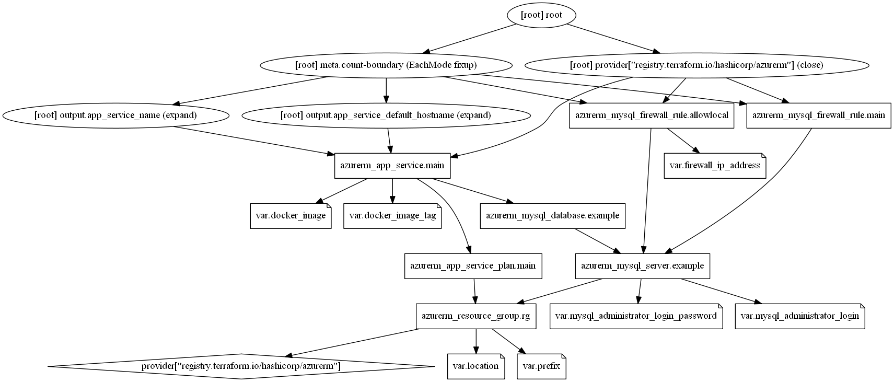

# Terraform keolis BBL demo

Terraform configuration to deploy n-tier infra (webb app + database) to azure 

## Archi



## Requirements

- Install terraform
- Install Azure CLI

## cmd to build infrastructure

create a `terraform.tfvars` (copy `terraform.tfvars.example`) and set variables.

```bash

# Authenticate using the Azure CLI
$ az login

# Initialize your Terraform config
$ terraform init

# Plan your Terraform Run
$ terraform plan

# Apply your Terraform Config
$ terraform apply

# Destroy your infrastructure
terraform destroy

```

After deployed : check url from outputs and test the app deployed (creds : admin/admin)

https://${var.prefix}-example-app-service.azurewebsites.net/

## links

Tuto Get Started Azure
https://learn.hashicorp.com/collections/terraform/azure-get-started

Terraform on Azure documentation
https://docs.microsoft.com/en-us/azure/developer/terraform/

Terraform Azure provider
https://registry.terraform.io/providers/hashicorp/azurerm/latest/docs